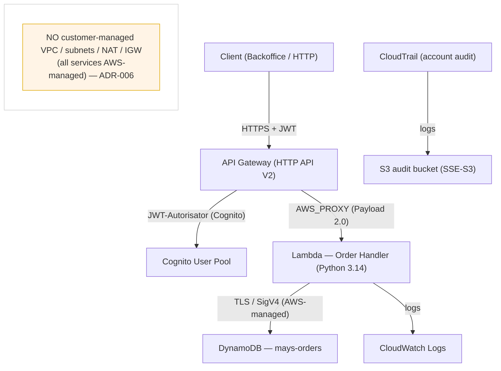
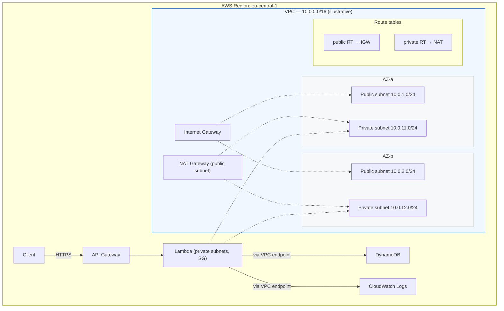

# Networking — May's Orders

> **Status:** Documentation / architecture only. **No customer-managed VPC is deployed and no
> Terraform networking resources exist.** This page shows (A) the current LOWEST/PROTOTYPE
> position and (B) an *illustrative* production/industry-standard target.
> **Region:** `eu-central-1`.

---

## 1. Purpose

Professor acceptance requirement #2 asks for "AWS networking — VPC, public/private subnets,
regions, AZs, CIDR". This page makes the project's networking position explicit and honest:

- **A. What the current prototype actually is** (managed/serverless, **no** customer-managed VPC).
- **B. How a production/industry-standard target network would look** (VPC, subnets, AZs, CIDR).

The two are deliberately **not blurred**: the target is a design/migration reference, **not**
currently deployed infrastructure.

---

## 2. Current prototype networking position (verified)

| Aspect | Current value |
|---|---|
| AWS Region | `eu-central-1` (Europe/Frankfurt), via `var.aws_region` |
| VPC | **none** (0 customer VPCs) |
| Public/private subnets | **none** |
| Internet Gateway / NAT Gateway | **none** |
| Route tables / NACLs / Security Groups | **none** |
| VPC endpoints | **none** |
| Lambda `vpc_config` | **none** — Lambda runs in the AWS-managed execution environment |
| Service access | AWS SDK over TLS/SigV4; API Gateway edge TLS |

Reasons the prototype intentionally has no customer-managed VPC (ADR-006):

- The application flow is `Client → Cognito → API Gateway → Lambda → DynamoDB`, all **managed
  serverless services** with no requirement to reach private on-prem/EC2 resources.
- A VPC today would add routing/NAT/VPC-endpoint design, infrastructure complexity, and potential
  networking cost **without a functional need** for the prototype.

> This does **not** mean VPC is unnecessary for *all* production Lambda architectures — only that
> it is not justified for the current prototype scope (see §4).

Current diagram:

---

## 3. Production / industry-standard target (illustrative, NOT deployed)

The following is an **illustrative** production target. The CIDRs, subnets and AZ layout are
example values to make the required concepts concrete — **they do not exist in AWS** and are
**not** defined in Terraform.

| Element | Illustrative target value |
|---|---|
| AWS Region | `eu-central-1` |
| VPC | `10.0.0.0/16` |
| Availability Zones | `az-a`, `az-b` (2 AZs) |
| Public subnet (az-a) | `10.0.1.0/24` |
| Private subnet (az-a) | `10.0.11.0/24` |
| Public subnet (az-b) | `10.0.2.0/24` |
| Private subnet (az-b) | `10.0.12.0/24` |
| Internet Gateway | attached to VPC (public subnet egress) |
| NAT Gateway | in a public subnet (private subnet egress) |
| Route tables | public RT → IGW; private RT → NAT |
| Lambda | in **private** subnets (`vpc_config` + security group) |
| VPC endpoints | optional: DynamoDB / S3 / CloudWatch gateway/interface endpoints |
| Security Groups | Lambda SG (egress to DynamoDB/VPC endpoints only) |
| Network ACLs | subnet-level stateless control (defense in depth) |

Target diagram:

> All CIDRs, AZ names and subnet shapes above are **illustrative target values only** — not
> deployed, not in Terraform. Any future implementation would be a separate, human-approved
> architectural decision (ADR) before adding networking resources.

---

## 4. Why the prototype does not implement this now

Introducing the §3 VPC/subnet/NAT/VPC-endpoint architecture now would:

- increase infrastructure and operational complexity (routing, NAT, endpoints, SGs/NACLs);
- potentially add networking cost (NAT Gateway hours/data, VPC endpoints);
- require additional design decisions (AZ placement, CIDR sizing, private-egress path)
  that are **not needed** by the current `API Gateway → Lambda → DynamoDB` request flow;
- add no functional benefit for the prototype's single-region, managed-serverless use case.

The production target becomes justified when the organization actually needs:

- private-resource reachability (RDS, ElastiCache, on-prem via VPN/Direct Connect);
- explicit network isolation/control, security-group segmentation, or centralized egress;
- compliance/regulatory network boundaries;
- lower-latency private connectivity via VPC endpoints for high-volume integrations.

Until such a requirement is stated, the prototype stays VPC-free (ADR-006) and documents the
target for future evolution.

---

## 5. Professor demo language

> **What is deployed/planned now:** a serverless backend in `eu-central-1` —
> Cognito (auth) → API Gateway (HTTPS) → Lambda → DynamoDB, with CloudWatch logging and
> CloudTrail audit. Everything runs on AWS-managed services; there is **no customer-managed VPC**
> today, because the request flow to a private network is not required.
>
> **Why no VPC today:** the prototype is deliberately LOWEST/PROTOTYPE (ADR-006). A VPC would add
> routing/NAT/endpoint complexity and cost without a functional need at this stage.
>
> **Where VPC/private-subnet/AZ/CIDR live:** documented as a concrete *production target* in
> `architecture/networking.md` — a `10.0.0.0/16` VPC across two AZs (`eu-central-1`) with
> public (`10.0.x.y/24`) and private (`10.0.x.y/24`) subnets, IGW/NAT, and Lambda placed into
> private subnets with VPC endpoints.
>
> **How it evolves to industry standard:** the target is introduced when private-resource,
> network-control, compliance or integration requirements justify it — as a separate,
> human-approved architectural decision.

---

## 6. Consistency guarantees

- No documentation here claims the target VPC is deployed.
- Terraform contains **no** networking resources (`aws_vpc`, `aws_subnet`, `aws_nat_gateway`,
  `aws_internet_gateway`, `aws_route_table`, `aws_security_group`, `aws_network_acl`,
  `aws_vpc_endpoint`, and no Lambda `vpc_config`) — confirmed.
- ADR-006 ("kein VPC/NAT/Subnets für den Prototyp") remains the governing decision and is unchanged.
- `eu-central-1` is used consistently.
- All CIDRs/subnet/AZ values are explicitly labelled *illustrative target*.

---

Related: `architecture/architecture-and-security.md` (§B Network Topology),
`architecture/architecture-decisions.md` (ADR-006), `terraform/README.md` (§9.7).
Execution log: `docs/reports/PROFESSOR-ACCEPTANCE-AUDIT-EXECUTION-LOG.md`.